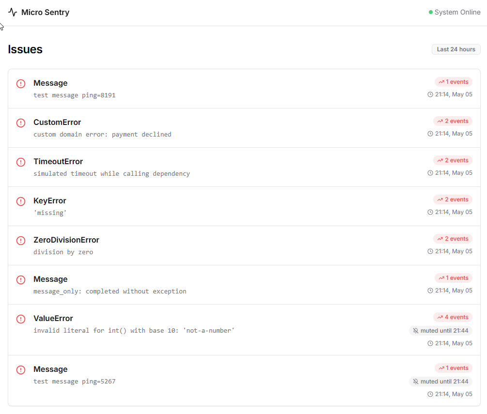

# Micro Sentry

Минимальный “свой Sentry”: принимает события в формате Sentry **envelope** и показывает простой UI со списком issues и страницей issue (stacktrace/tags).

Важно: это **in-memory** сервис (данные живут в памяти процесса), ретеншн событий — **24 часа**.

## Функционал

- **Приём событий**: `POST /api/{project_id}/envelope/` (поддерживается `Content-Encoding: gzip`)
- **UI**
  - **Dashboard**: список issues за 24 часа, сортировка по последнему событию
  - **Issue page**: детали и stacktrace (если присутствует в payload), tags
- **Mute / Ignore issue**
  - можно **заглушить issue на время** (15м / 1ч / 24ч)
  - пока issue в mute, новые события с тем же fingerprint **не увеличивают счётчик и не обновляют latest_event/last_seen**

## Быстрый старт (локально)

```bash
python3 -m venv .venv
source .venv/bin/activate
pip install -r requirements.txt
uvicorn app.main:app --host 127.0.0.1 --port 8000 --reload
```

Откройте UI: `http://127.0.0.1:8000`

## Docker

Сборка:

```bash
docker build -t micro-sentry:local .
```

Запуск:

```bash
docker run --rm -p 8000:8000 micro-sentry:local
```

Порт/хост можно переопределить переменными окружения:

```bash
docker run --rm -e PORT=8011 -p 8011:8011 micro-sentry:local
```

## Как подключить SDK (пример на Python `sentry-sdk`)

DSN для этого сервера имеет вид:

- **локально**: `http://public@127.0.0.1:8000/1`
- **docker-compose** (если сервис называется `micro-sentry`): `http://public@micro-sentry:8000/1`

Пример инициализации:

```python
import sentry_sdk

sentry_sdk.init(
    dsn="http://public@127.0.0.1:8000/1",
    traces_sample_rate=0.0,
    send_default_pii=False,
    environment="local",
    release="demo@local",
)
```

Отправка тестовой ошибки:

```python
import sentry_sdk

try:
    1 / 0
except Exception as e:
    sentry_sdk.capture_exception(e)

sentry_sdk.flush(timeout=5)
```

В репозитории есть готовый скрипт, который шлёт **несколько разных** событий:

```bash
source .venv/bin/activate
SENTRY_DSN="http://public@127.0.0.1:8000/1" python simulate_sentry_error.py
```

## Как пользоваться mute/ignore

На странице issue доступны кнопки:

- **Игнорировать 15м / 1ч / 24ч**
- **Снять игнор**

Технически это:

- `POST /issue/{issue_id}/ignore?minutes=15|60|1440`
- `POST /issue/{issue_id}/unignore`

## Скриншоты

Dashboard:



Issue page:


