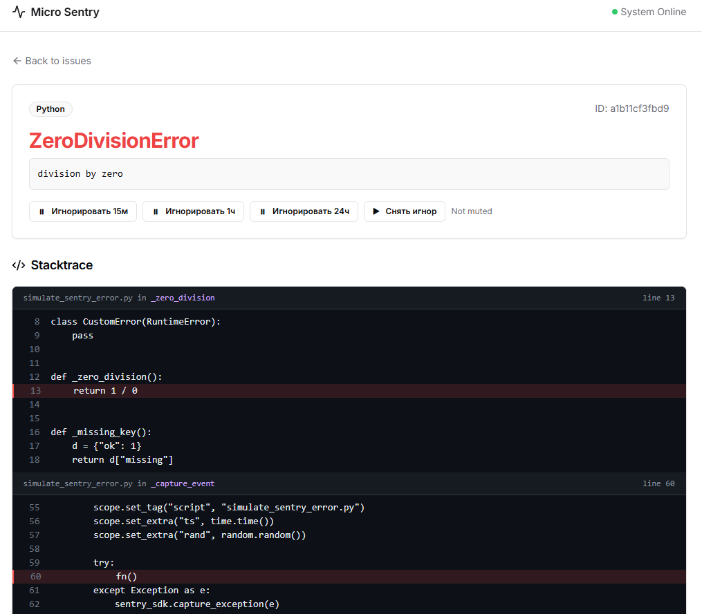
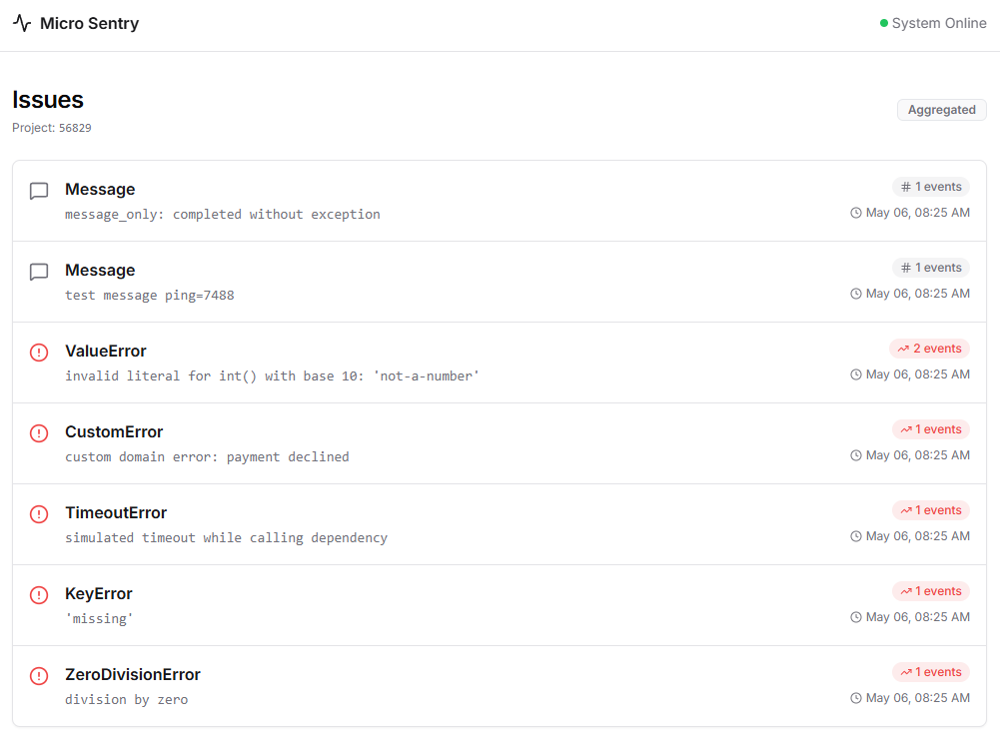

# Micro Sentry

Лёгкий self-hosted приёмник ошибок, совместимый с форматом Sentry Envelope. Предоставляет минималистичный UI для просмотра issues, stacktrace и тегов.

---

## Назначение

Micro Sentry предназначен для сценариев, когда необходим базовый мониторинг ошибок без сложной инфраструктуры:

- нет необходимости в расширенных функциях Sentry (алерты, релизы, перформанс-мониторинг, управление командами и правами доступа)
- нет желания разворачивать полноценный self-hosted Sentry (Postgres + ClickHouse + Kafka + Snuba + Relay)
- достаточно простого приёмника событий с веб-интерфейсом

Демо страница: `https://micro-sentry.vpuhoff92.workers.dev/ui/demo/`
---

## Функциональность

| Функция | Описание |
|---|---|
| **Приём событий** | `POST /api/{project_id}/envelope/` с поддержкой `Content-Encoding: gzip` |
| **Dashboard** | Список issues за последние 24 часа, сортировка по времени последнего события |
| **Страница issue** | Stacktrace (при наличии в payload), теги, детали события |
| **Mute / Ignore** | Подавление issue на 15 мин / 1 ч / 24 ч; события с тем же fingerprint не обновляют счётчик и `last_seen` |

---

## Ограничения

**Python / FastAPI версия** — хранение в памяти процесса, retention событий — **24 часа**.

**Cloudflare Workers + Durable Objects версия** — агрегаты хранятся в DO, очистка через `alarm()`, по умолчанию **7 дней**.

---

## Быстрый старт

### Локально

```bash
python3 -m venv .venv
source .venv/bin/activate
pip install -r requirements.txt
uvicorn app.main:app --host 127.0.0.1 --port 8000 --reload
```

Откройте в браузере: `http://127.0.0.1:8000`

### Docker

```bash
# Сборка
docker build -t micro-sentry:local .

# Запуск
docker run --rm -p 8000:8000 micro-sentry:local

# Переопределение порта
docker run --rm -e PORT=8011 -p 8011:8011 micro-sentry:local
```

---

## Подключение SDK

DSN формируется следующим образом:

- локально: `http://public@127.0.0.1:8000/1`
- внутри docker-compose (если сервис называется `micro-sentry`): `http://public@micro-sentry:8000/1`

### Инициализация

```python
import sentry_sdk

sentry_sdk.init(
    dsn="http://public@127.0.0.1:8000/1",
    traces_sample_rate=0.0,
    send_default_pii=False,
    environment="local",
    release="demo@local",
)
```

### Отправка тестового события

```python
import sentry_sdk

try:
    1 / 0
except Exception as e:
    sentry_sdk.capture_exception(e)

sentry_sdk.flush(timeout=5)
```

В репозитории есть готовый скрипт для отправки нескольких разных событий:

```bash
source .venv/bin/activate
SENTRY_DSN="http://public@127.0.0.1:8000/1" python simulate_sentry_error.py
```

---

## Mute / Ignore

На странице issue доступны кнопки подавления:

- **Игнорировать 15 мин / 1 ч / 24 ч**
- **Снять игнор**

API:

```
POST /issue/{issue_id}/ignore?minutes=15|60|1440
POST /issue/{issue_id}/unignore
```

Пока issue находится в состоянии mute, новые события с тем же fingerprint не увеличивают счётчик и не обновляют `latest_event` / `last_seen`.

---

## Скриншоты

### Python / FastAPI UI (историческая версия)

**Dashboard**


**Issue page**



### Cloudflare Workers UI (текущая)



---

## Cloudflare Workers + Durable Objects

Альтернативная версия на базе Cloudflare Workers + Durable Objects. Агрегирует события по хешу, не сохраняя каждое событие отдельно.

### Архитектура хранилища

| Параметр | Значение |
|---|---|
| **Ключ** | `sha256(exception_type + exception_value + stacktrace_fingerprint)` |
| **Значение** | `{ count, first_seen, last_seen, payload }` (payload = последнее событие) |
| **TTL** | Записи с `last_seen` старше 7 дней удаляются через `alarm()` |

### Эндпоинты

#### Ingest

```
POST /api/{project_id}/envelope/   # совместимо с sentry-sdk
POST /api/{project_id}/store/      # прямая отправка JSON-события
```

#### Read API

```
GET /api/{project_id}/issues?limit=200
GET /api/{project_id}/issue/{issue_hash}
```

#### UI

```
GET /ui?project=12345
GET /ui/{project_id}/
GET /ui/{project_id}/issue/{issue_hash}
GET /ui/projects/new               # создание проекта, возвращает project_id и SENTRY_DSN
```

### Локальная разработка

```bash
npm install
npx wrangler dev
```

### Деплой

```bash
npx wrangler login
npx wrangler deploy
```

> **Примечание:** для Durable Objects на Free-плане требуется `new_sqlite_classes` в миграциях — уже настроено в `wrangler.toml`.

### Настройка sentry-sdk

DSN:

- локально (wrangler dev): `http://public@127.0.0.1:8787/1`
- production: `https://<your-worker-domain>/1`

```python
import sentry_sdk

sentry_sdk.init(
    dsn="https://public@<your-worker-domain>/12345",
    traces_sample_rate=0.0,
)

try:
    1 / 0
except Exception as e:
    sentry_sdk.capture_exception(e)

sentry_sdk.flush(timeout=5)
```

SDK автоматически отправляет envelope на `/api/{project_id}/envelope/` при использовании DSN.
